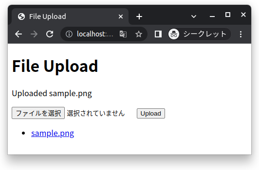

# simple-upload-server
HTTP server that accepts file upload from web browser



Run directly:

```
npx github:milhidaka/simple-upload-server
```

Files will be uploaded to current directory.

DO NOT expose this server to the internet. Clients can read / write any file under upload directory (default: current directory) without any authentication.
